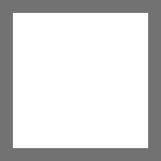

# ZOOT

[https://exaether.org](https://exaether.org)

ZOOT is a database of all available operators.  
Yes, I know, there is already other tools that does that, so why am I recreating it?  
Because I wanted my Terminal System to not be Primitive, and rather be an Oil Tank.

## What is ZOOT?
More seriously, ZOOT is basically a calculator, so it does that, and not something else.
ZOOT is designed to be rather straightforward. It display information you will use, and don't display the ones you won't.

## What can ZOOT do?
ZOOT can can do what you expect of an operators database:  
- List all operators.  
- Can display precise stats and info about every operator.  

But it can also do things you can't in other alternatives:  
- Display DPS/HPS calculations.  
- Other relevant graphs like DP gen, or survivability  
- Let you compare theses calculations between operators.  
- Gives you advices on how to use operators and their usefulness.  

Overall, ZOOT is designed to give a better visibility on the performance of operators.
This is meant to help doctors choose what operator, skill and module they should use, and most importantly, in what situation.  

Do keep in mind that ZOOT assumes the doctor's brain is composed of more than 2 originium slugs. 
At least enough to understand that a seemingly higher line doesn't always means better everywhere.  
My goal by creating this tool is *not* to make some operators *look* objectively better than other, but rather to show who is better **depending on what you want**.

## What ZOOT Isn't?
ZOOT isn't a skin viewer, it does display skins, but isn't meant for that.
To do that, please go check [HermitzPlanner](https://hermitzplanner.github.io/skins/#).  
ZOOT isn't a planner, it only displays what relates to the performance of operators, not their upgrade cost.
To do that, please go check [Krooster](https://www.krooster.com/) and [Penguin Stats](https://penguin-stats.io/)

# What is inside ZOOT?
ZOOT is developped using the [SvelteKit](https://svelte.dev/docs/kit/introduction) framework.  
I'm using my other project, [Slumber Bridge](https://github.com/Exaether/slumber-bridge) as a source of game data.
Slumber bridge's game data mostly come from [Arknights Assets](https://github.com/ArknightsAssets/ArknightsGamedata).  
The images are from [PuppizSunniz's fork of Aceship's Arknights-images](https://github.com/PuppiizSunniiz/Arknight-Images) 
and [fexli's ArknightsResource](https://github.com/fexli/ArknightsResource).  
I'm incredibly thankful to them for providing this data.  
But obviously, the don't own this data, and neither do I, all data belongs to Hypergryph Network Technology Co., Ltd.

## Developping
After cloning the repo and installing dependencies with `npm install`, you can run the server with `npm run dev`.  
The production version can be built with `npm run build`.  
Note that i'm running ZOOT on the same server as Slumber Bridge. 
You'll need to define the url where slumber bridge is in the `SLUMBER_URL` environment variable. You can do that either with a .env file or in a docker compose file for the prod build.

# What will ZOOT become?

I'm still planning to add things to ZOOT. Keep in mind this is a personal project, and they are only plans, so I can't say when they will be available.  
- Story reader / Lore notebook
- Event shop calculator (Probably using Penguin stats)
